# 🚀 Deployment Guide

This repository uses a fully automated CI/CD pipeline that handles testing, version bumping, and publishing to NPM without any manual intervention.

## 🚀 Automated CI/CD Pipeline

### How It Works

1. **Continuous Integration (CI)**
   - Runs automatically on every push to `main` branch and on pull requests
   - Tests across Node.js versions 18, 20, and 22
   - Runs linting, unit tests, integration tests, and security audits
   - Builds the package to ensure it compiles correctly

2. **Automatic Version Bumping**
   - After CI tests pass on `main` branch, the system analyzes commit messages
   - Automatically determines the appropriate version bump type:
     - **Major**: `BREAKING CHANGE`, `feat!`, `fix!`, `chore!`
     - **Minor**: `feat`, `feature`
     - **Patch**: `fix`, `patch`, `chore`, `docs`, `style`, `refactor`, `test`
   - Updates `package.json`, generates changelog, creates Git tag
   - Creates GitHub release with automatic release notes

3. **Automatic NPM Publishing**
   - Triggered automatically when a new Git tag is pushed
   - Verifies tests pass, builds production package
   - Publishes to NPM with public access and provenance
   - Skips publishing if version already exists

### 🔄 Workflow Sequence

```mermaid
graph TD
    A[Push to main] --> B[CI Tests]
    B --> C{Tests Pass?}
    C -->|Yes| D[Analyze Commits]
    C -->|No| E[❌ Stop - Fix Issues]
    D --> F{Version Bump Needed?}
    F -->|Yes| G[Bump Version]
    F -->|No| H[ℹ️ No Release Needed]
    G --> I[Update Changelog]
    I --> J[Commit & Push]
    J --> K[Create Git Tag]
    K --> L[Create GitHub Release]
    L --> M[🏷️ Tag Triggers NPM Publish]
    M --> N[Run Tests Again]
    N --> O[Build Package]
    O --> P[📦 Publish to NPM]
    P --> Q[✅ Complete!]
```



## 🏗️ Available Workflows

### 1. Main CI/CD Pipeline (`.github/workflows/ci-cd.yml`)
- **Trigger**: Push to main, pull requests
- **Purpose**: Full automated pipeline from testing to release
- **Actions**: Test → Version bump → Release → Trigger NPM publish

### 2. NPM Publishing (`.github/workflows/npm-publish.yml`)
- **Trigger**: Git tags (`v*`), GitHub releases
- **Purpose**: Publish package to NPM registry
- **Actions**: Test → Build → Publish

### 3. Manual Version Bump (`.github/workflows/version-bump.yml`)
- **Trigger**: Manual workflow dispatch
- **Purpose**: Manual control over releases when needed
- **Actions**: Test → Version bump → Release → Trigger NPM publish

## 📝 Commit Message Conventions

To ensure proper automatic version bumping, use conventional commit messages:

### Major Version (Breaking Changes)
```bash
git commit -m "feat!: redesign API with breaking changes"
git commit -m "BREAKING CHANGE: remove deprecated methods"
```

### Minor Version (New Features)
```bash
git commit -m "feat: add new payment method support"
git commit -m "feature: implement webhook validation"
```

### Patch Version (Bug Fixes)
```bash
git commit -m "fix: resolve payment callback issue"
git commit -m "chore: update dependencies"
git commit -m "docs: improve installation guide"
```

### No Version Bump
```bash
git commit -m "ci: update workflow configuration"
git commit -m "test: add unit tests for edge cases"
```

## 🔧 Manual Release (When Needed)

If you need manual control over a release:

1. Go to **Actions** tab in GitHub
2. Select **Manual Version Bump and Release**
3. Click **Run workflow**
4. Choose:
   - Version type: `patch`, `minor`, or `major`
   - Release notes (optional)
   - Skip tests option (not recommended)

## 📋 Prerequisites

### Repository Secrets
Ensure these secrets are configured in GitHub repository settings:

```bash
NPM_TOKEN=your_npm_token_here
GITHUB_TOKEN=automatically_provided
```

### NPM Token Setup
1. Go to [npmjs.com](https://www.npmjs.com)
2. Navigate to **Access Tokens** in your account settings
3. Create a new **Automation** token
4. Add it as `NPM_TOKEN` secret in GitHub repository

## 🛡️ Security & Quality

- **Security Audits**: Runs `npm audit` on every build
- **Multi-Node Testing**: Tests across Node.js 18, 20, and 22
- **Build Verification**: Ensures package builds correctly
- **Duplicate Prevention**: Checks if version already exists before publishing
- **Provenance**: NPM packages include build provenance for security

## 📊 Monitoring

### Check Pipeline Status
- **GitHub Actions**: Monitor all workflows in the Actions tab
- **NPM Registry**: Verify published versions at [npmjs.com/package/medusa-payment-ipay](https://www.npmjs.com/package/medusa-payment-ipay)
- **Releases**: Track releases in the GitHub Releases section

### Troubleshooting

**Pipeline Failed?**
1. Check the Actions tab for error details
2. Fix the issues in your code
3. Push the fix - pipeline will run automatically

**Version Not Bumped?**
- Ensure your commit messages follow conventional format
- Check if there are commits since the last tag
- Use manual workflow if needed

**NPM Publish Failed?**
- Verify `NPM_TOKEN` secret is valid
- Check if version already exists on NPM
- Ensure package builds correctly locally

## 🎯 Best Practices

1. **Small, Focused Commits**: Make commits that represent single logical changes
2. **Clear Commit Messages**: Follow conventional commit format
3. **Test Locally**: Run tests before pushing to avoid CI failures
4. **Review Changes**: Use pull requests for collaborative review
5. **Monitor Releases**: Check that automation worked as expected

## 📞 Support

If you encounter issues with the deployment pipeline:
1. Check the GitHub Actions logs for detailed error messages
2. Verify repository secrets are correctly configured
3. Ensure commit messages follow the conventional format
4. Use manual workflows as fallback when needed

---

*This automated pipeline ensures consistent, reliable releases while maintaining high code quality and security standards.* 